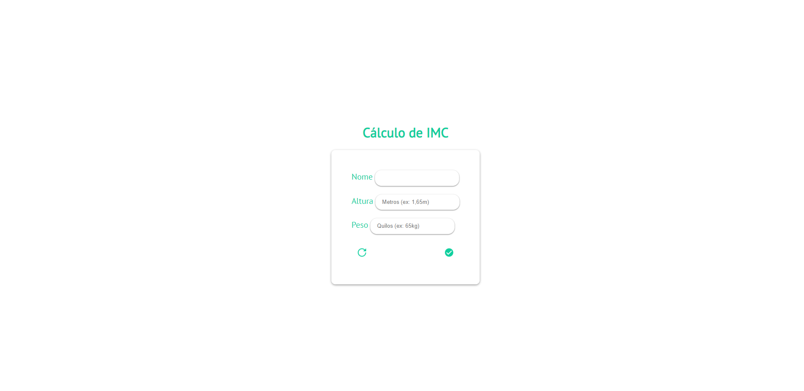

# Atividades-escolares
Esse repositório tem a função de guardar algumas atividades que realizei durante meu ensino médio

# Financiamento de Carro 
O Objetivo do projeto era desenvolver um site para realizar uma simulação do cálculo de um financiamento de um carro#

# Calculadora de Corriga
Calculadora de velocidade média e pace para o cliente

# Cálculo de IMC
Calculadora de IMC
